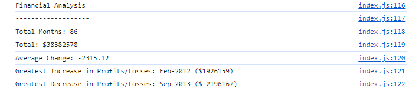

# Console-Finances

Analyzing financial records of a company

## Description

The provided code calculates:

* The total number of months included in the dataset.

* The net total amount of Profit/Losses over the entire period.

* The average of the changes in Profit/Losses over the entire period.

* The greatest increase in Profit/Losses (date and difference in the amounts) over the entire period.

* The greatest decrease in Profit/Losses (date and difference in the amounts) over the entire period.

## Usage

All calculations and results are displayed on the webpage console.
 
Please refer to the included screenshot for a view of the console output.

  

 
